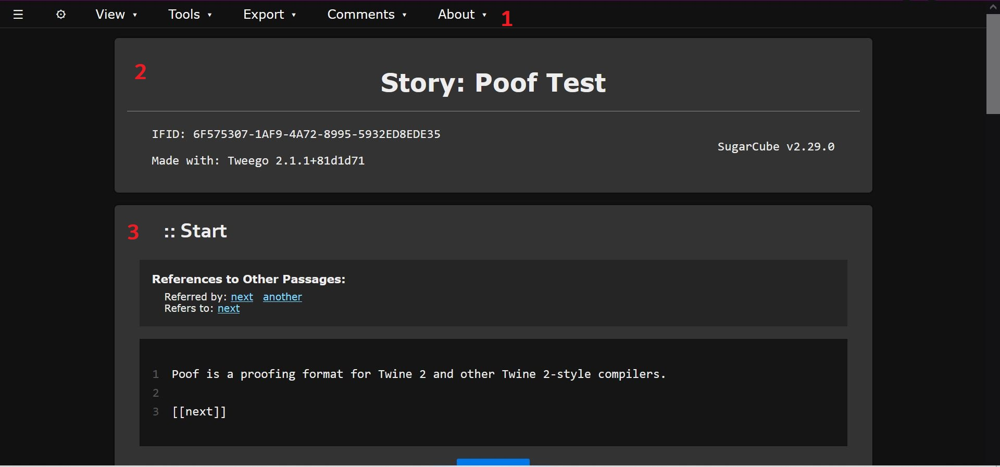
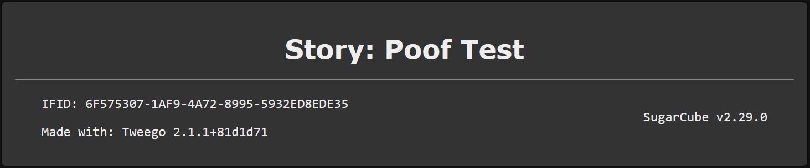
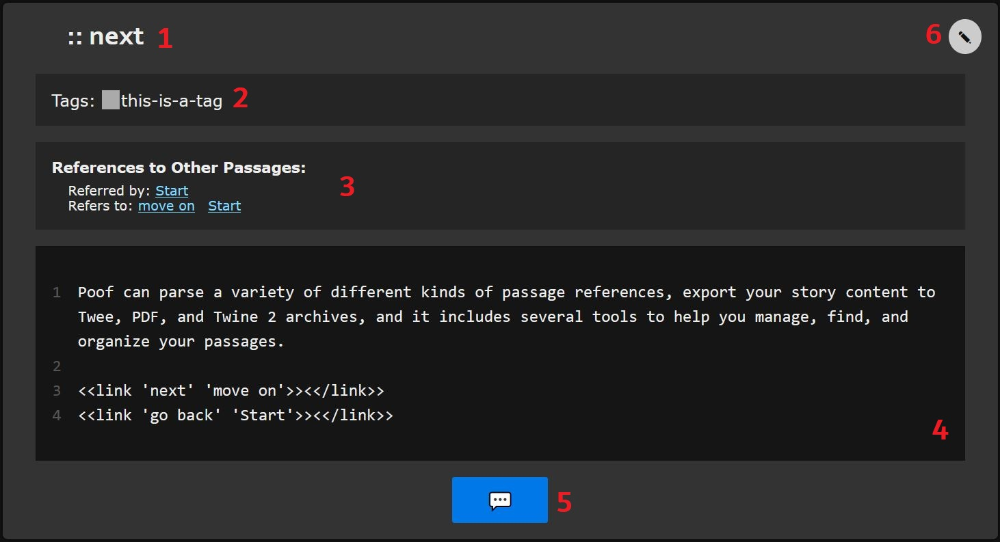

# Introduction

Demos:  
- [Example HTML output](https://twinelab.net/poof/demo/)  
- [Example PDF output](https://twinelab.net/poof/demo/poof.pdf)  
- [Example plain text output](https://twinelab.net/poof/demo/poof.txt)

Poof is a Twine 2 proofing and utility format that empowers you to review, edit, and proofread your content in a more productive way.

If you have ideas, requests, or problems, please [open an issue on the github repo](https://github.com/ChapelR/poof/issues/new).

**Features:**  
- Simple and readable, but  customizable and feature-rich.  
- Create comments and notes on passages that can be exported, imported, and shared with others.  
- Tools to help you organize, sort, filter, and find passages using a variety of metrics.  
- Parses your code for links and macros that reference other passages, allowing you to click through your game or follow along while playing.  
- Export your passages to PDF, plain text (in twee notation), or Twine 2 archive files.  
- Review your stylesheet and JavaScript code in addition to your passages, with story format-aware linting for your JavaScript. 

## Installation

The online version of poof is currently hosted via the [jsDelivr CDN](https://www.jsdelivr.com/). 


You can install poof using this URL: `https://cdn.jsdelivr.net/gh/chapelr/poof@latest/docs/use/format.js`. Copy and paste that URL into Twine 2 by clicking on `Formats` then `Add New Format` in the story list view (where all your stories are visible). Then go over to `Proofing Formats` and select poof. To use the proofing format, choose the `View Proofing Copy` option from the menu when editing a story. It's right above the `Publish to File` option.

To get a local copy of poof, go to the [releases page on the repo](https://github.com/ChapelR/poof/releases) and find the `poof.zip` file under assets for the version you want and download it.

For other compilers, you need to make the compiler aware of the format. How you do that will depend on the compiler, so refer to your compiler's docs. Note that poof is only compatible with Twine 2-style compilers.

### Other Versions

Older versions of poof can be accessed by replacing the `@latest` in the URL with `@v[version number]`, e.g. poof 0.5.1 would be `https://cdn.jsdelivr.net/gh/chapelr/poof@v0.5.1/docs/use/format.js`. Only valid release versions of poof can be accessed in this manner.  The valid releases are:

- v0.5.1 (beta)  
- v1.0.0  
- v1.1.0  
- v1.2.0  
- v1.3.1  
- v1.4.1 
- v1.5.0
- v1.6.0 (latest)

You can also access the development version of poof with the URL `https://cdn.jsdelivr.net/gh/chapelr/poof@latest/docs/use/dev.js`. The development version is never stable, and is not recommended for general use.

[Changelog](changelog)  
[Release Notes](https://twinelab.net/blog/tags/poof/)

## Credits 

Open source software used:

- [twinejs](http://twinery.org/) (GPL-3.0)  
- [pdfmake](http://pdfmake.org/) (MIT)  
- [download.js](http://danml.com/download.html) (CC-BY-4.0)  
- [jshint](https://jshint.com/) (MIT)  
- [highlight.js](https://highlightjs.org/) ([License](https://github.com/highlightjs/highlight.js/blob/master/LICENSE))  
- [highlightjs-line-numbers.js](https://wcoder.github.io/highlightjs-line-numbers.js/) (MIT)  
- [jQuery](https://jquery.com/) (MIT)  
- [normalize.css](https://necolas.github.io/normalize.css/) (MIT)  
- [pure.css](https://purecss.io/) (BSD)

Built with:

- [nodejs](https://nodejs.org/en/) ([License](https://raw.githubusercontent.com/nodejs/node/master/LICENSE))  
- [gulp](https://gulpjs.com/) (MIT)  
- [node-zip](https://github.com/daraosn/node-zip) (MIT)

## Buy Me a Coffee

[](https://ko-fi.com/F1F8IC35)

---

# Usage Guide

This is a quick guide to help you get acclimated to poof and some suggestions about how to best use the format. Poof should, hopefully, be self-explanatory on a basic level.

## Overview

> [!NOTE]
> The first time you use poof, it may take several seconds to load. Poof relies on a number of external libraries fetched over the network, though many of its basic features will work without an Internet connection. These external libraries will be cached to your machine for future use, speeding up future load times and allowing poof to be used in all its glory without an Internet connection. Just be aware that the long initial load times (10+ seconds) are normal.


To get started after installing poof, open your story in the Twine 2 app, open the menu (bottom left of the screen, near the story's name, is an up arrow that opens the menu), and click `View Proofing Copy`. If you're using another compiler, like Tweego, you'll need to set the format option to poof--the CLI compilers treat proofing formats the same as all other formats. For example, `tweego -f poof -o my-poof-story.html src`.

### The Proofing View

Your project, as rendered by poof, should wind up looking something like this:



1. This is the main menu, with several submenus. You have a set of *View* options for fine-tuning your experience, or switching to the CSS and JavaScript views, *Tools* for managing your passages, and menu options for handling exports and comments.  
2. This is your story's header, which contains your project's *story metadata*.  
3. This is a *passage card*. Each passage in your story (aside from certain special passages, like `script`-tagged passages) gets a card. You can sort, find, filter your passage cards from the Tools menu.

### The Header



The story metadata pulled from your story by poof, including your story's title, IFID (important to know for some compilers), selected story format, and more are listed in the header.

### The Passage Card



The passage card contains all the content and metadata for a passage.

1. The passage's title.  
2. The passage's tags (if any). You can click on tags to quickly [filter](#tools) passages.  
3. The passage's references: passages referenced to or by this passage are listed here, as links you can navigate to within poof.  
4. The passage's raw content.  
5. The comment button--create, view, and edit comments regarding this passage.  
6. Clicking the pencil icon creates a new comment, pre-filled with the passage's content so you can note changes you want to make.

> [!NOTE]
> Poof will attempt to parse many different kinds of passage references, not just markup links, based on the format you are using.

### Passage List

You'll likely immediately notice your story's vital information on display, including story and passage data. Across the top of the window is several menus, and a hamburger icon ( &#9776;) on the left. Clicking this icon toggles the passage list interface, which you can use to quickly jump to passages by clicking on their names.

>  [!NOTE]
> When you use tools (see [below](#tools)) to sort and filter your passages, these changes will also be reflected in the passage list.

### Options

> [!TIP]
> You can use the `poof.config` special passage (see [below](#configuration)) to set these options for a given story so that you don't have to, say, go turn on the dark mode option every time you view your proofing copy.

Click on the gear icon (&#9881;) to configure your proofing view.

- `Night Mode`: This option toggles the page between the standard light-on-dark theme and a dark-on-light theme that may be easier on some eyeballs.
- `Simplified View`: This option removes some of the boxes, borders, and shadows that separate passages and other elements. You may prefer reading without my dead-sexy CSS skills getting all up in your eyes. I promise I'm not offended. Click to toggle.  
- `Line Numbers`: You can use this option to toggle the display of line numbers in your source code.  
- `Code Text Height`: I'm open to a better name for this option. To keep things somewhat sane when dealing with massive passages, poof will by default limit the height of code boxes and slap scrollbars on them after about 15 or so lines. If you'd rather not have that happen, you can toggle this option to see everything.

### View

The next menu is the `View` menu, which allows you to switch between viewing your story's passages, JavaScript, and stylesheet.

- `Passages`: This is the default view; click it to see your story data and all your passages and their code and tags.  
- `JavaScript`: This view shows your Story JavaScript area or equivalent.  
- `Stylesheet`: This view shows your Story Stylesheet or equivalent.  

### Tools

If you have a lot of passages, you'll likely want a way to sort, filter, and find them.

- `Filter`: This option allows you do determine what passages you want to see. For example, you can set poof to only show you `widget`-tagged passages, only passages with `castle` in the name, or even only show passages with [comments](#comments). You can also filter by the text of your passages, but be aware that this is somewhat slow to resolve based on the number of passages and their length. You can use the `Invert` check-box to instead filter **out** the passages that meet the specified criteria. To get all your passages back again, come back here and click the `Clear` button.  
- `Sort`: You can sort your passages based on a few different metrics, and can get those results in ascending or descending order by using the `Reverse` check-box. You can sort by passage name (alphanumeric), the length of the passage's text, or by *Passage ID*. Passage IDs are numbers that start at 0 and count up as you create passages, meaning their order is largely the same as the order in which you created your passages (though this ordering isn't guaranteed, necessarily), and is poof's default order.  
- `Find`: You can use this tool to find a specific passage by name. The text input also functions as a drop down list, and will make suggestions as you type. If you try to find a passage that you've previously filtered out, it will magically pop back into existence none the worse for wear.
- `Start`: This tool allows you to immediately scroll the story's starting passage into view.

### Syntax Highlighting 

Poof provides syntax highlighting for the JavaScript and CSS code views, but *not* for passage source code.

### Linting

> [!NOTE]
> Using the linter requires an Internet connection initially, though the library used will cache to your machine for future use, provided you use poof fairly frequently. If you have a connection and the linter still doesn't work, wait a little while and try again.

Poof can also [*lint* your JavaScript code](https://en.wikipedia.org/wiki/Lint_%28software%29). Linting helps you find errors, inconsistencies, and weirdness in your code.

Poof uses [JSHint](https://jshint.com/) for linting.

## Exporting Your Story

Poof comes with a few options for exporting your story to help you get the most out of your proofreading time. Note that when you export your story to any of the following formats, the comments you've made won't go with it.

### Twee

> [!WARNING]
> The generated Twee export will not include any passages you've currently filtered out. The sort order you have set up will also influence the order of the passages in the Twee file.

The first way you can export is to [Twee notation](https://twinery.org/cookbook/terms/terms_twee.html), in a plain text format. This is useful both for editing, and for transitioning your story to a different compiler, like Twee2 or Tweego.

### PDF

> [!WARNING]
> The generated PDF export will not include your `poof.config` passage, or any passages you've currently filtered out. The sort order you have set up will also influence the order of the passages in the PDF file.

> [!NOTE]
> Using the PDF exporter requires an Internet connection initially, though the library used will cache to your machine for future use, provided you use poof fairly frequently. If you have a connection and the exporter still doesn't work, wait a little while and try again.

Exporting to PDF is useful if you want a printable copy of your story, or something very easy to share and send around, regardless of device. This is probably mostly useful for authors working with non-Twine-using editors.

### Archive

> [!NOTE]
> The archive option will not respect your filter or sort settings.

As you (hopefully) know, you can make a back-up of all of your stories by creating an archive from the story list in Twine 2. You should do this a lot. This option does exactly the same thing, but only creates an archive of the current story. This archive can be used to back-up your story (though really, look into version control) and can also be used with certain compilers like Entwine and Tweego.

> [!TIP]
> When you import an archive, it sometimes won't work at first. Try changing your story format and reselecting your start passage to fix this.

### JSON

>[!NOTE]
>The JSON option will not respect your filter or sort settings.

You can export your story to JSON format, which can allow you to import your passage data into other tools and applications. You can optionally include additional metadata and optionally pretty print the data.

## Comments

Comments can be added to any passage. The blue comment button under every passage shows you how many comments each passage has and allows you to create, view, edit, and delete them. Click this button, then `+ Add a comment...` to get started. You can also click the pencil icon (&#9998;) in the upper right corner of a passage card to create a new comment that is pre-filled with the text of the passage, to make notes about edits or changes you want to make.

> [!NOTE]
> While it'd be ideal to let authors simply edit their passages in poof, and while that would be simple to implement, there is currently no way for proofing formats to send data back to the Twine app, meaning any changes would not be reflected in you story or in the Twine app. For this reason, poof instead saves your edits to a passage just like any other comment.

A comment must have either a body or a title, or both. After you make a comment, it will appear in a list where `+ Add a comment...` used to be, along with a `New Comment` button. To read, edit, or delete a comment, click on any part of it in the list.

### Local Storage

> [!TIP]
> It is recommended that you periodically make back-ups of your comments via the `Comments > Export` menu option (see [below](#comment-files)). While local storage is a fairly safe place for data, if you stop using poof for a while, it's possible that your browser will allow poof's data to be overwritten. It's also possible that clearing your browing history in certain ways or using certain "free up disk space" tools could delete your comment data.

Poof saves your comments to your browser's local storage anytime they are changed in anyway. This means that some care must be taken to preserve them, just like your Twine stories. Note that each story you open with poof will have it's own little place to hang out in local storage, so don't worry about overwriting one project's comments with another.

### Comment Files

You can export and import comments. Imported comments are added to whatever comments are already there, so you don't generally need to worry about overwrites here, but you may also wind up with duplicates from time to time. To export your comments, go to the `Comments` menu and click `Export`. This will create a file and download it for you. To import a file, click `Import` in the `Comments` menu and select a valid file to upload.

Poof will warn you if it has reservations about the file you're trying to upload, like if the comments come from a story with a different IFID than the one you're importing comments into, if there don't appear to be any comments, or if the file has unexpected data. You can try to import the comments anyway, if you want.

If the story you import the comments into doesn't have a passage that the comment file has comment data for, you'll be told about it, but these stateless comments will be ignored.

## Configuration

You can configure your poof experience with a special passage in your story. This passage must be written in JSON format and called `poof.config`.  You have a number of options you can use to set things up for your viewing pleasure.

### The `poof.config` Passage

A `poof.config` passage may look like this:

```
{
    "nightMode": true,
    "ignoreTag": "widget",
    "fonts": {
        "main": "Arial",
        "code": "Courier New"
    },
    "pdf" : {
        "lineHeight": 2,
        "font": "monospace"
    },
    "json" : {
        "verbose" : true
    }
}
```

The above settings tell poof that want the proofing copy to default to night mode (saving you a click every time you view the proofing copy), that you want to ignore `widget`-tagged passages, that you want the main font used by most text to be Arial and the font used for passage text and code to be Courier New, and that you want the PDF export to be double-spaced and in a monospace font.

The following options can be used:

- `nightMode`: Set this option to `true` or `false`. If true, poof will default to night mode. The default setting is `false`.  
- `simplified`: Set this option to `true` or `false`. If true, poof will default to the simplified view mode. The default setting is `false`.  
- `lineNumbers`: Set this option to `true` or `false`. If true, line numbers will be shown in source code by default. The default setting is `true`.
- `codeHeightLimit`: Set this option to `true` or `false`. If true, poof will default to showing about 15 lines of code before using scrollbars. The default setting is `true`.  
- `ignoreTag`: Set this option to a string that represents a valid Twine tag (i.e. no spaces). Passages with this tag will not be imported by poof. The default is `"poof.ignore"`.  
- `fonts`: A sub-object with two properties, `main` and `code`. You can set custom fonts / font stacks for poof using this option. Note that if your browser doesn't support the indicated font(s), the browser will use its (ugly) default font. The default font stacks are `Verdana, Geneva, sans-serif` for `main` and `Consolas, monaco, monospace` for `code`.  
- `format`: A sub-object with two properties, `name` and `version` (which should be a string, like `"1.0.1"`). In Twine 2, poof will automatically detect which story format you have selected and tune the linter and some other features to match that information if it's a *major* format (i.e. Harlowe, SugarCube, Snowman, or Chapbook). In CLI compilers like Tweego, this isn't possible, and the automatically detected format will be poof, which isn't helpful. Set this option to a valid version of the format you want to use to either override what poof detects from Twine 2 or to set the format for the CLI compilers.  
- `globals`: This option should be set to an array of strings. Each string represents the name of a global variable that your JavaScript has access to, such as from an external JavaScript library. Poof will automatically register the *documented* globals of the core Twine 2 story formats, so you only need to use this to tune the linter when using undocumented features, third-party formats, or external JavaScript (and only if the warnings about undefined variables bother you when using the linter).  
- `pdf`: This sub-object controls the various styles and features of the PDF export. You can change the `lineHeight` (line spacing) and set it to a number between `1` (single-spaced) and `2` (double-spaced). The default line height is `1.15`. Use the `fontSize` option to change the size of the text in the exported file (the options are `"very small"` [8pt], `"small"` [10pt], `"normal"` [12pt], `"large"` [14pt], and `"very large"` [16pt]). The default is `"normal"` (12pt). The `font` option can be used to set the font to a `"monospace"` (Consolas), `"serif"` (Georgia), or `"san-serif"` (Roboto) font. The default font is `"sans-serif"` (Roboto).  
- `json`: This sun-object controls the settings of the JSON export. You can provide an integer for how many spaces the JSON's pretty printing should include for each level with the `pretty` property. If you pass a `0`, the JSON will not be pretty printed, and instead be minified. The `verbose` property can be set to `true`, causing additional meta data to be added to the JSON output.
- `twee`: set this option to `1`, `2`, or `3`. This option controls the encoding used by the Twee encoder, and can export Twee to the [classic style](http://twee-twine-doc.tiddlyspot.com/) used be Twine 1.4.2 and other first generation Twee compilers if set to `1`, to the format used by [Twee2](https://dan-q.github.io/twee2/documentation.html#twee2-syntax) if set to `2`, or to the new Twee 3 specification format, as [seen here](https://github.com/iftechfoundation/twine-specs/blob/master/twee-3-specification.md), if set to `3`.  
- `parse`: set this option to `true` or `false`. If true, poof will parse passages for "passage references," including link markup and a subset of macros (if poof supports the story format's macro set; it currently only supports Harlowe and SugarCube macros, and only link, click, and goto style macros), and will add information about which passages are referenced by and have references to each other passage in the passage card interface, including links that can be used to zoom to those passage cards.

> [!WARNING]
> Extremely large stories may take a very long time to parse for passage references (possibly multiple minutes). The `parse` option should be set to `false` in your `poof.config` passage if you are encountering very long start-up loading times.

> [!NOTE]
> **About the Twee specifications**: Poof defaults to using the [Twee3 encoding format](https://github.com/iftechfoundation/twine-specs/blob/master/twee-3-specification.md) which is supported by Tweego v2.x and Extwee. You should also only use the Twee 2 encoding format if you are using the [Twee2 compiler](https://dan-q.github.io/twee2); it is not actually an official specification, and it is only used and understood by that compiler. If you are using the original Twee, Twine 1.4.2, Entwine, or Tweego v1.x, you'll want to export to the Twee 1 spec.

> [!TIP]
> Writing valid JSON can be a bit tricky. Here's a validator to help you: https://jsonlint.com/. Plug your JSON in there, and the validator will tell you what, if anything, is wrong with it.

### Ignore Tag

Sometimes you just want to see the major, writing-heavy passages, not all your `startup`-tagged passages with their variable declarations or all your `widget`-tagged passages with their lengthy widget definitions. You can use the ignore tag (`poof.ignore`, by default) to keep these out of your hair. Poof won't even load any passages with the ignore tag, meaning they will be completely unavailable to you from within poof.

You can also change the tag to make your life a little easier. For example, if you need to ignore all your widget-definition passages, instead of adding the `poof.ignore` tag to each one, you can use the above `poof.config` special passage to change the ignore tag to `widget`.